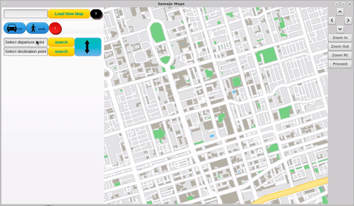

# Semejo-Maps
ECE297 Geographic Information System (GIS) Project

The application used the OpenStreetMap database and an intuitive Graphical User Interface (GUI) to display city information. Other features included an intersection finder, route finder, map zooming and panning. Users could load other city information as well. 

The code is private to avoid academic offenses.

The project was divided into 4 milestones:

## Milestone 1
Extracted city information such as streets, intersections, buildings, parks, and other geographic features from the OpenStreetMap database and loaded them into data structures. Wrote functions to answer simple queries.  

## Milestone 2
Drew the map to visualize the city features. Edited UI to allow for users to interact with the map, these iteractions included panning, zooming and searching for streets and intersections.

### Demo

## Milestone 3
Wrote algorithms to find travel routes between between intersections. We initially used the Depth First Search (DFS) algorithm but then implemented an A* greedy algorithm to achieve faster run times. 

### Demo

## Milestone 4
Wrote algorithms to find a travel routess for many courier deliveries to minimize travel time. 
